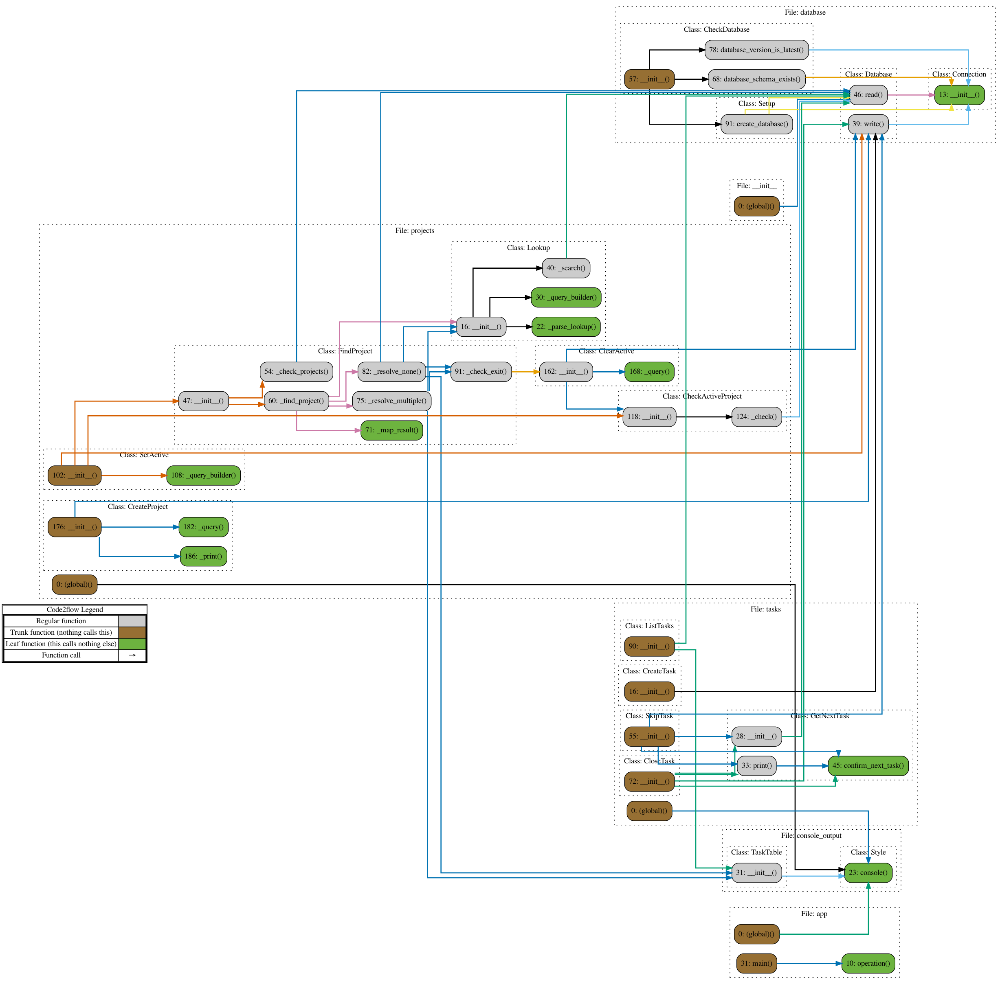

# Next-task

A barebones task management solution for those that have far too much to do.

## About

Install by running `python3 -m pip install git+https://github.com/MakeJames/Next-Task.git`

### Tasks

Tasks are a descrete unit of work that needs to be done, such as:

* `email Fred the stats from last quarter`
* `read the article about bees`

Tasks can be added to the list of tasks at any stage, with `Next -a [summary]`. When 
requested with `Next -t` the list of tasks is prioritied and the next highest priotiy 
task is returned to the user. This task can then be actioned to completeion and marked 
as complete with `Next -d`. 

For whatever reason the "next" task can be skipped with `Next -s`, which will add time
to the due date which will reduce it's priority. Bear in mind that older tasks will come 
up with more frequency than newer tasks.

The next task is stateful, so when you have an active task it will remain the next task, 
until it is completed. This means that if new tasks are added whilst actioning a task, 
the current task will remain the same until completed or skipped.

Type `Next` to view a complete list of open tasks.

### Projects

Projects are less transiant than tasks and give the user the ability to create a subset of
their task list that is grouped by theme or larger project. They can be long running or have
defined scope and completed. Unlike tasks, projects are not prioritised by due date, but are 
user selected. 

Within each project there is a defined task list and when there is an active project, next
tasks will be returned from the project tasks.

## Development

```bash
git clone git@gitlab.com:mcbean-workspace/next-task.git
cd next
make dev
poetry run Next --version
```

New functionality should be made on a feature branch `feature/feature_name` and merged to `main`


### Versioning

```bash
poetry version
```

Version increments are definbed as Major.Minor.Patch

Merge Checklist:

**Pre-merge**
- Unit tests are written and coverage is at 85%
- README and Documentation is up to date
- Changelog for tag is completed
- iSort is run on import statements using Make Format
- pyproject.toml
- next_tasks/VERSION

**Post-merge**
- feature branch is deleted
- tag is created on Main

### Lint and Test

Code should be complient with PEPs 8, 256, 484 and 526.
Unit test coverage should be 85% or higher.

```bash
make check # calls make lint; make test
make coverage # returns the coverage report
```

### Commit Messages

Commit messages are prefixed with the following stubs

```bash
INIT # structural changes to pakage contents
FUNC # functional changes
DOCS # documentation
TEST # commits adding tests to the repository
LINT # corrections to formatting or spelling
REFACTOR # Non functional changes to functions improving performance or readability
```

### Structure

dev tools come with code2flow, can generate an up-to-date structure diagram with `code2flow -o docs/class_diagram.png -q next_task/`

