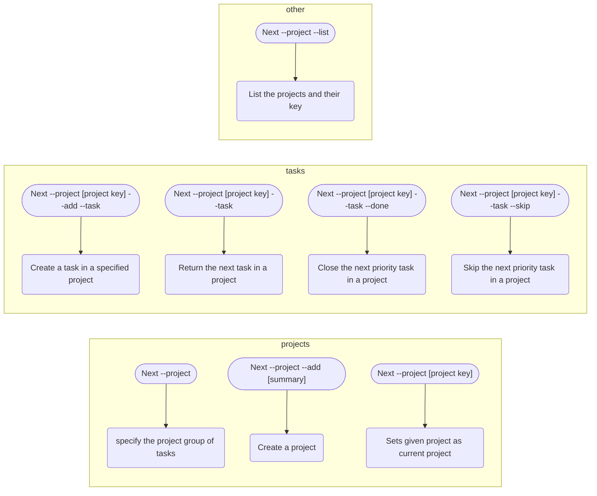

# Next task: Projects

Projects are a large task, they can be long running or have defined scope and completed. Unlike tasks, 
projects are not prioritised by due date, but are user selected. 

Within each project there is a defined task list and when there is an active project, next tasks will be 
returned from the project tasks.

Task creation should remain unaffected, so even when there is a defined 'current' project, new tasks will 
default to the general task list.

If a current project is set, the need to provide a project key is redundant.

## TODO

* [ ] list projects
* [ ] set project as current
* [ ] create task in project
* [ ] complete task in project
* [ ] skip task in project
* [ ] if in project then set project

## Options

